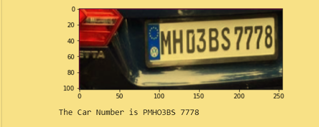
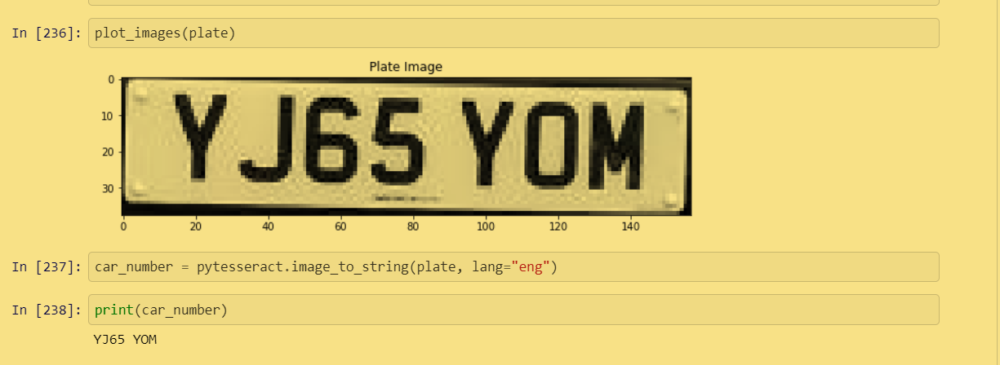

# Vehicle-Number-Plate-Detection

This helps us to detect the number on the number plate of a vehicle..

## Approach

Here for locating the boards I used two different approaches:-

1. DEEP LEARNING + OPENCV Approach - Trained VGG16 model to locate the Number Plate Location with the topx,topy,bottomx and bottomy locations of each image in the Training dataset. 

2. OPENCV Approach - Converted Images from RGB to Grayscale, Detected edges and contours.

After detecting the Board Locations by both the approaches I cropped the Number Plate portion and used Pytesseract Image to String and detected the Number on the Number Plate..

## Different Notebooks

Here are the different notebooks:

[Deep Learning + OPENCV Approach](https://nbviewer.jupyter.org/github/Rahul1582/Vehicle-Number-Plate-Detection/blob/master/Number%20Plate%20Detection%20Deep%20Learning.ipynb): Used CNN + OPENCV here for the Vehicle number Detection.

[OPENCV Approach](https://nbviewer.jupyter.org/github/Rahul1582/Vehicle-Number-Plate-Detection/blob/master/Vehicle%20Number%20Plate.ipynb): Used purely OPENCV here for the Vehicle number Detection.

## Dataset Used 

I had used the Vehicle Number Plate Detection dataset from kaggle for the Deep Learning + OPENCV Approach 

Dataset can be found [here](https://www.kaggle.com/dataturks/vehicle-number-plate-detection). 

## Technologies Used
```
1. CNN VGG16

2. OPENCV

3. Tensorflow

4. Keras

5. Pytesseract
```

## Results

These were the Car Numbers detected after both the approaches..

### Using Deep Learning+ OPENCV Approach-
  
<br>


### Using Purely OPENCV Approach-

<br>


## Improvement

We can increase the accuracy of the model by training it with more images with perfect orientation and improved quality of images..

## Author 
```
Rahul Kumar Patro
```